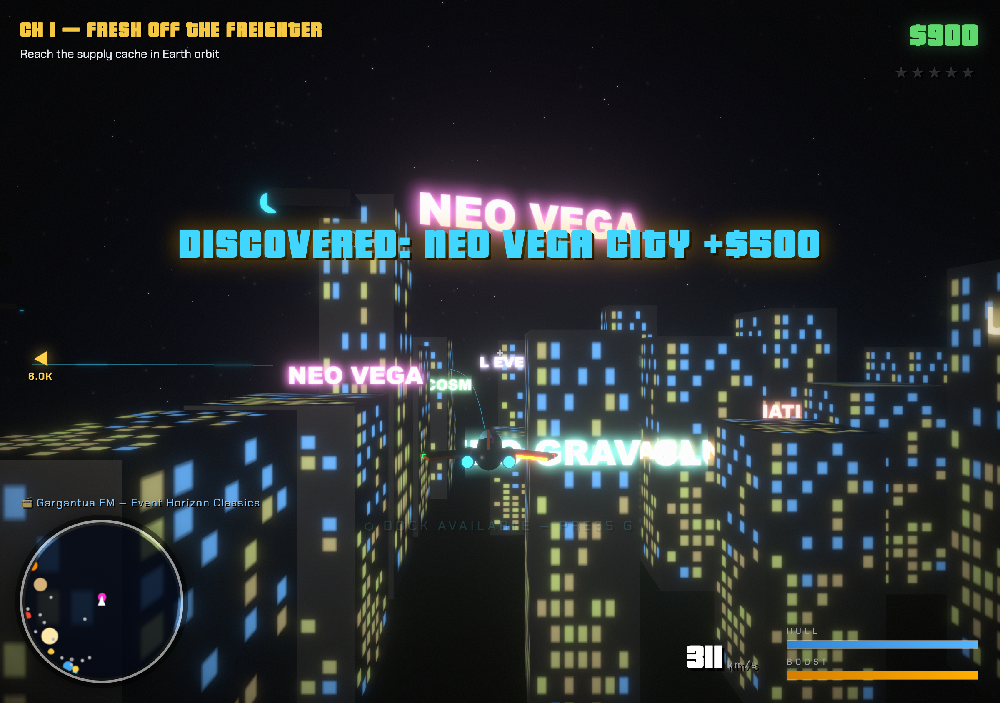
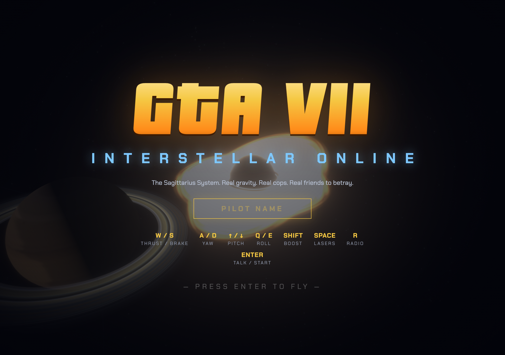

# GTA VII: INTERSTELLAR

Open-world space crime in the Sagittarius System. Next.js + React Three Fiber. Single-player, deploys anywhere Next.js runs — including Vercel.




## Run

```sh
npm install
npm run dev        # http://localhost:3000
```

Deploy: standard Next.js app — `vercel`, or `npm run build && npm start`.

## Story mode — THE DRIFT

Eight chapters with dialogue (advance with **ENTER**):

1. **FRESH OFF THE FREIGHTER** — prove you can fly, tag a cache in Earth orbit
2. **RING RUNNER** — thread three drop buoys around a moving Saturn
3. **BADGE OF DISHONOR** — Marshal Okoye wants a tax; pay in scrap metal
4. **THE DERELICT** — pull a data core out of Gargantua's gravity well, then escape it
5. **SLINGSHOT** — five patrols, full heat, then vanish
6. **WELCOME TO NEO VEGA** — find the neon city and dock
7. **ROCK HUSTLE** — mine 5 ore chunks from the belt's glowing rocks
8. **KING OF THE BELT** — kill RED VARGA at the pirate hideout

Finish the story to unlock endless free-roam side jobs. Dying restarts the active objective and costs a $200 dry-dock fee.

## Neo Vega City

A neon free-station floating between Earth's orbit and the black hole: ~35 lit towers to fly between (they hurt), holographic billboards, shuttle traffic looping the canyons, and a landing pad that doubles as a garage + ore market. Cops will chase you straight into the streets.

## Flight feel

- **Click** the screen for pointer-lock mouse flight (keyboard A/D + arrows still work)
- **X** = overdrive: ~6× thrust for crossing the system, auto-cuts near gravity wells, heat, or the belt
- KSP-style trajectory line, screen-edge waypoint arrow with distance, damage flash + camera shake, 3s respawn protection
- **ESC/P** pause menu, **J** galaxy log

## Exploration — Galaxy Log (J)

7 discoveries pay cash bonuses the first time you find them: Neo Vega, Luna, a comet on a long ellipse, a derelict science vessel in Gargantua's well, a monolith (1:4:9), the pirate hideout, and a sun-grazing dare. Hints are in the log.

## Economy

- **Mining**: shoot the gold-glowing belt rocks, scoop the ore chunks, sell at any dock ($90/ea)
- **Pirates** guard the belt: $150 + credit chips per kill, no police heat
- **Convoys**, **side jobs**, **Saturn Circuit** time trials, cop bounties — all still pay

## Physics

- Planets ride analytic Keplerian orbits around **Helios** (Earth ~8 min, Mars ~5 min, Saturn ~15 min) — on rails, KSP-style
- Your ship feels inverse-square gravity from **every body**: the sun, three planets, and the black hole. Slingshots work. Decaying orbits work
- **Helios** (kill radius) and **Gargantua's event horizon** are lethal; planets bounce you off with hull damage
- Mission markers anchor to orbiting bodies — your destination moves, lead it

## World extras

- **Asteroid belt** between Mars and Earth orbits — collide and you crater, but heat decays 3× faster inside (police can't track you through the rocks)
- **Trajectory preview** — cyan line predicts your path through the gravity field, KSP-style. Read it to line up slingshots
- **Meridian Station** rides Earth orbit — fly close, press **G** to dock at the garage: armor, boost tanks, engine tunes, dual cannons, paint jobs
- **Saturn Circuit** — fly through the cyan gate near Saturn to start a time trial: 7 rings + return. Best lap saved
- **Smuggler convoys** cross the system every couple of minutes — wipe all three gold haulers for $1,000 (and a 2-star spike)
- **Sound** — engine hum follows the throttle, lasers fall off with distance, and each radio station plays its own procedural loop (R to dial)

## Persistence (no database)

Your save — cash, story progress, upgrades, paint, best lap — lives in `localStorage` and restores on reload.

## Controls

| Key | Action |
| --- | --- |
| W / S | thrust / brake |
| A / D | yaw |
| ↑ / ↓ | pitch |
| Q / E | roll |
| Shift | boost |
| Space | lasers |
| R | radio |
| G | dock / undock at station |
| Enter | advance dialogue / start |

## Architecture

- `src/game/physics.js` — body table, Kepler orbit positions, summed gravity
- `src/game/world.js` — mutable 60fps state (no React renders)
- `src/game/store.js` — zustand: HUD, story progression, garage, races
- `src/game/story.js` — chapters, dialogue, objective definitions
- `src/components/` — R3F scene: textured planets, shader accretion disk, procedural ships, laser/explosion pools

In dev, `window.__game = { world, useStore }` for debugging.

> Multiplayer (Socket.IO lobby, PvP bounties, shared leaderboard) was removed in this version — it lives at commit `837b7b1` if you ever want it back.
