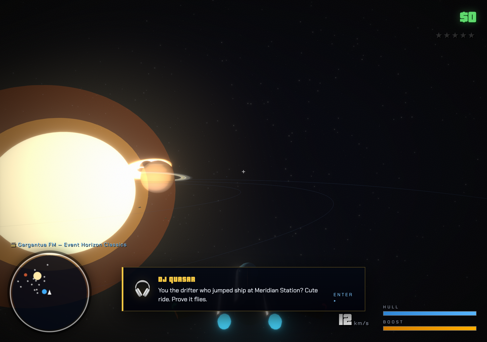

# GTA VII: INTERSTELLAR ONLINE

Multiplayer open-world space crime in the Sagittarius System. Next.js + React Three Fiber + Socket.IO.




## Run

```sh
npm install
npm run dev        # http://localhost:3000
```

Multiplayer over the internet:

```sh
ngrok http 3000    # share the URL — Next.js pages and the Socket.IO lobby ride the same port
```

Everyone who opens the link spawns in the same solar system (server shares one orbital epoch, so the planets line up for the whole lobby). You see other pilots' ships, name tags, and laser fire. Friendly fire is on.

## Story mode — THE DRIFT

Five chapters with dialogue (advance with **ENTER**):

1. **FRESH OFF THE FREIGHTER** — prove you can fly, tag a cache in Earth orbit
2. **RING RUNNER** — thread three drop buoys around a moving Saturn
3. **BADGE OF DISHONOR** — Marshal Okoye wants a tax; pay in scrap metal
4. **THE DERELICT** — pull a data core out of Gargantua's gravity well, then escape it
5. **SLINGSHOT** — five patrols, full heat, then vanish

Finish the story to unlock endless free-roam side jobs. Dying restarts the active objective and costs a $200 dry-dock fee.

## Physics

- Planets ride analytic Keplerian orbits around **Helios** (Earth ~8 min, Mars ~5 min, Saturn ~15 min) — on rails, KSP-style
- Your ship feels inverse-square gravity from **every body**: the sun, three planets, and the black hole. Slingshots work. Decaying orbits work
- **Helios** (kill radius) and **Gargantua's event horizon** are lethal; planets bounce you off with hull damage
- Mission markers anchor to orbiting bodies — your destination moves, lead it

## Controls

| Key | Action |
| --- | --- |
| W / S | thrust / brake |
| A / D | yaw |
| ↑ / ↓ | pitch |
| Q / E | roll |
| Shift | boost |
| Space | lasers |
| R | radio |
| Enter | advance dialogue / start |

## Architecture

- `server.js` — custom Next server + Socket.IO lobby (join/state/fire/pvp-hit relay, shared orbit epoch)
- `src/game/physics.js` — body table, Kepler orbit positions, summed gravity
- `src/game/world.js` — mutable 60fps state (no React renders)
- `src/game/store.js` — zustand: HUD, story progression, multiplayer roster
- `src/game/story.js` — chapters, dialogue, objective definitions
- `src/components/` — R3F scene: textured planets, shader accretion disk, procedural ships, laser/explosion pools

In dev, `window.__game = { world, useStore }` for debugging.
